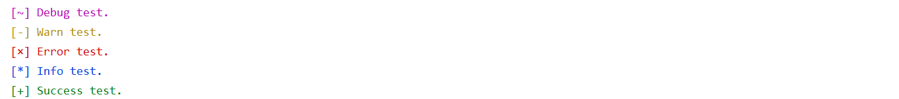

# SimpleLog

simplest logger with color.



usage:

```golang
func TestLogger2(t *testing.T) {
	var logger = Logger{}
	logger, err := New(true, "log.txt")
	if err != nil {
		fmt.Println(err)
		return
	}
	logger.Debug("Debug test.")
	logger.Warn("Warn test.")
	logger.Error("Error test.")
	logger.Info("Info test.")
	logger.Success("Success test.")
}
```

